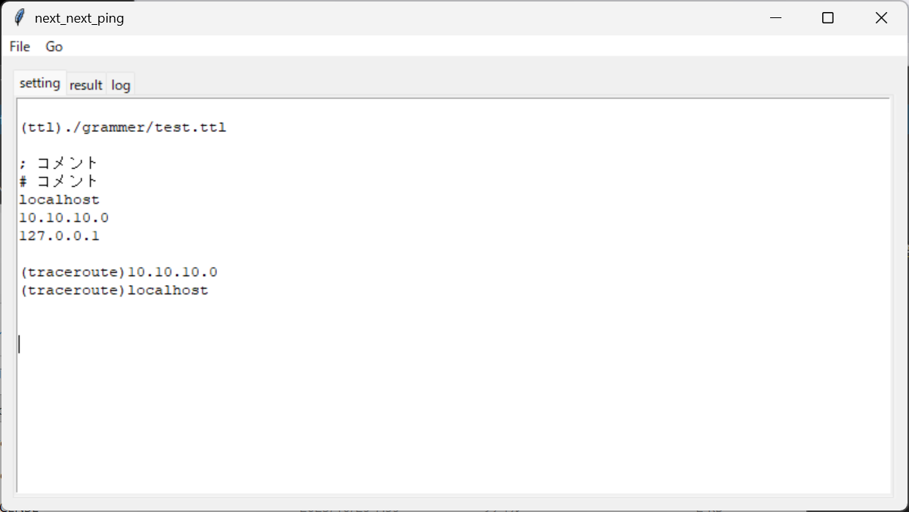
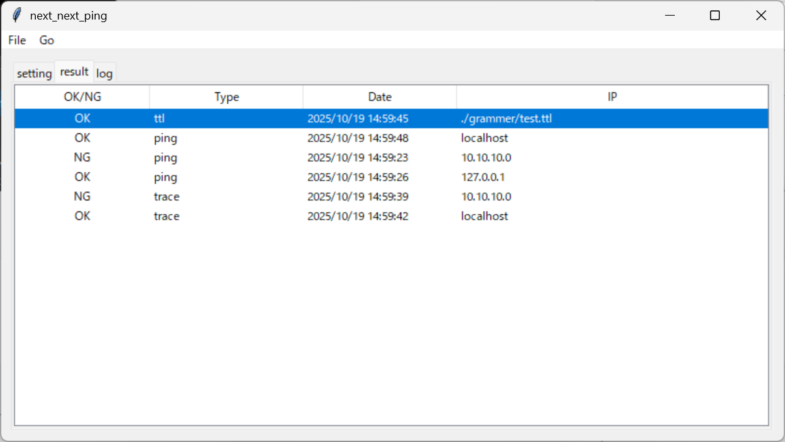
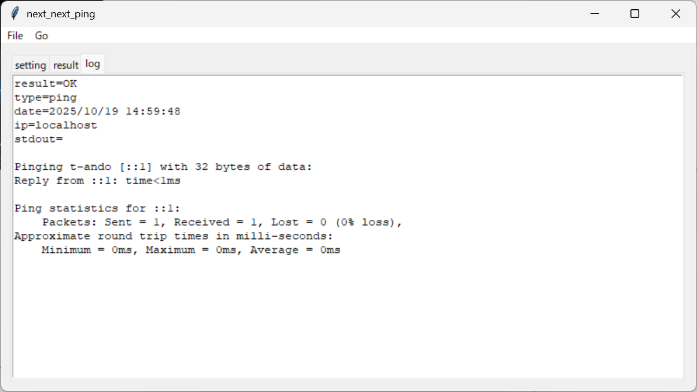

# NextNextPing

このソフトウェアはwindowsで多数の装置にpingを打つためのExPingのようなツールです。

## はじめに

- EXPing は実に素晴らしい。周期的にpingを発行してネットワーク上で止まったところをNG表示してくれるのだ。
- しかしながら問題がある。
- pingしか対応していないのだ。
- ネットワークを確認したいのであれば、ping以外にもtracerouteをしてほしいし、なんならsshで接続してサーバを踏み台としたpingを打ちたいのだ。
- そこで用意したのは新しい GUIの pingを打つツールだ。
- ついでにtracerouteを打てるようにした。
- そして踏み台サーバを用いたpingも用意しようとした。
- しかし、ここでpingをするには中継のコマンドプロンプトが分からないという問題があった。
  - そう、teraterm マクロのような機能が簡単に作れないのだ。
  - ならば作ればよいのだ。
  - そこで、pingを打つために必要な機能だけ teraterm マクロの機能から持ってきたのがこのソフトウェアになります。

## 特徴
- pythonで作ったので多分Linuxでも動きます。
- pingを打ってその結果でOKまたはNGが分かります。
- teraterm macro に似せた tera tekitou language (テラてきとうランゲージ、通称ttl)と呼ばれる言語で SSH接続し、他のサーバを踏み台としてpingを打てます。

## 画面イメージ

### トップ画面

  - トップの画面です。
  - pingを打つIPを指定します。
  - コメントアウトができます。
  - カッコつきの文字で(traceroute)と先頭に書くと、tracerouteをしてくれます。
  - カッコつきの文字で(ttl)と先頭に書くと、tera tekitou languageを起動し、SSH接続できるのでpingを打てます。
  - メニューバー上の File ⇒ Save setting を実行すると、テキストは保存されます。
  - メニューバー上の File ⇒ Save log を実行すると、実行したときのログが保存されます。

### 結果表示画面

  - メニューバー上の Go ⇒ Updateを実行すると、トップの画面を解析して実施内容を行で表現します。
  - メニューバー上の Go ⇒ Pingを実行すると、pingを定期的に実行します。
  - メニューバー上の Go ⇒ Pingを実行すると、pingを定期的に実行していたものを止めます。
  - 結果は OK またはNGで表示されます。

### ログ画面

  - 結果表示画面の行をクリックすると、その行に対応したログが表示されます。

# MACRO for Terawaros Tekitou Lanugage

Terawaros Tekitou Lanugage は NextNextPing 用マクロ実行プログラムです。マクロ言語 "Terawaros Tekitou Language (TTL)" によって、NextNextPing を制御し、オートダイアル、オートログインなどの機能を実現することができます。

- [MACRO言語 "Terawaros Tekitou Language (TTL)"](./doc/syntax.md)　
- [TTL コマンドリファレンス](./doc/command.md)　
