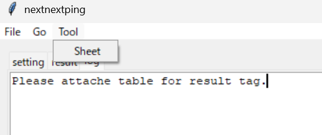

# ping用TTLマクロ作成支援ツール

## ツールの開き方

- メニューバーより、Tool ⇒ Sheet を選択します。

## メイン画面

- メイン画面です。
- メニュー画面のFileでツールの終了、csvの保存、csvの読み込みができます。
- メニュー画面のGoで、ttlマクロを生成します。
- Create ボタンで新しい行を生成できます。
- Modify ボタンで選択した行を修正できます。
- Delete ボタンで選択した行を削除できます。

## Fileメニュー

- メニュー画面のFileからSave csvでcsvの保存ができます。
- メニュー画面のFileからLoad csvでcsvの読み込みができます。
- メニュー画面のFileからCloseでツールを終了します。

## Goメニュー

- メニュー画面のGoからCreate ttlで表に対応したttlを生成します。

## 新規作成または編集画面

- file_name : ファイル名 です
- target_display : pingを打つ装置の表示名 です
- target_ip : pingを打つIP です (例) 127.0.0.1
- target_type : 設定する種別 です ("1=ping : 2=traceroute : 3=show run")
  - 種別により traceroute は tracert や tracepath に変わります。
  - 種別により show run は ipconfig や ifconfig に変わります。
- next_ssh : 踏台先有無 です ("0=Windows : 1=SSH login : 2=SSH->SSH login")
- base_type : SSH先の種別  です  ("1=cisco : 2=linux : 3=qx-s")
- base_display : SSH接続する表示名  です 
- base_ip : SSH接続するIP  です 
- base_account : SSH接続するアカウント  です 
- next_type : 踏み台先種別  です  ("1=cisco : 2=linux : 3=qx-s")
- next_display : SSHからさらに接続する装置の表示名です
- next_ip : 踏み台SSHのIPアドレス  です
- next_account : 踏み台先のアカウント  です 

### next_ssh が 0 のとき

- PC ⇒ target_ip に対して pingを打ちます。

### next_ssh が 1 のとき

- PC ⇒ base_ip にログインし、 target_ip から  pingを打ちます。

### next_ssh が 2 のとき

- PC ⇒ base_ip にログインして踏み台にし、さらに next_ipにログインして、target_ip から  pingを打ちます。

