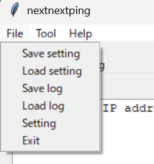
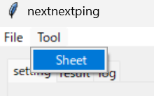
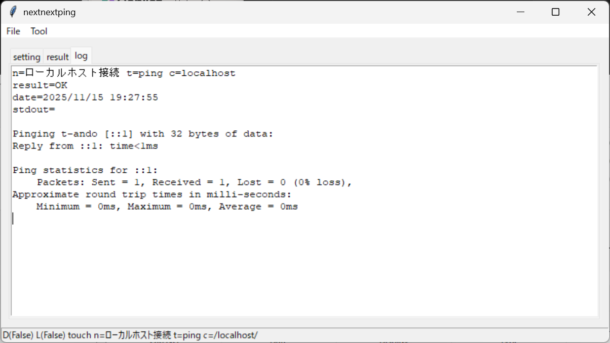
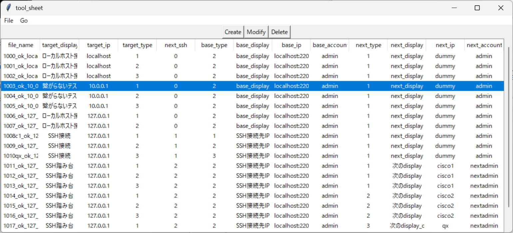
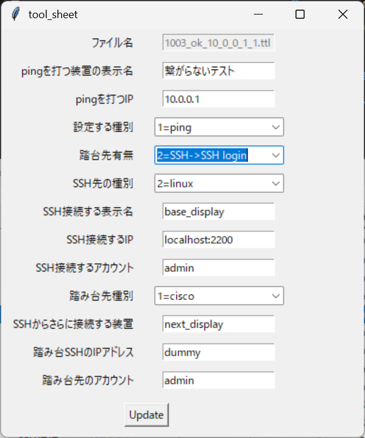

# Screen image

## トップ画面

- トップの画面です。
- pingを打つIPを指定します。
- `;` でコメントアウトができます。
- カッコつきの文字で`(traceroute)`と先頭に書くと、tracerouteをしてくれます。
- カッコつきの文字で`(show)`と先頭に書くと、ipconfig相当を打てます。
- カッコつきの文字で`(ttl)`と先頭に書くと、terawaros tekitou languageを読み込み、SSH接続できるのでpingを打てます。
- カギカッコ`[` と `]`つきの文字で説明として使われます。
- `Update` ボタンを実行すると、トップの画面を解析して行で表現します。[結果表示画面](#結果表示画面) に遷移します。

### メニューバー

- メニューバー上の File ⇒ Save setting を実行すると、設定をセーブしれます。
- メニューバー上の File ⇒ Load setting を実行すると、設定をロードします。
- メニューバー上の File ⇒ Save log を実行すると、実行したときのログをセーブします。
- メニューバー上の File ⇒ Load log を実行すると、実行したときのログをロードします。
- メニューバー上の File ⇒ Setting を実行すると、[設定画面](#設定画面) 用ダイアログが開きます。

- メニューバー上の Tool ⇒ Sheet を実行すると、[ping用TTLマクロ作成支援ツール](#ping-ttl-macro-creation-support-tool) を起動します。

## 結果表示画面

- `Ping` ボタンを実行すると、pingを定期的に実行します。
- `Stop` ボタンを実行すると、pingの実行を停止します。
- 結果は OK またはNGで表示されます。ttlの場合は、エラーとなるか、最後まで行って`result`が0のときにNGで表示されます。

## ログ画面

- 結果表示画面の行をクリックすると、その行に対応したログが表示されます。

## 設定画面

- debug: デバッグモードにします。
- loop: 最後までpingを実行したあと、ループします。
- wait_time: ping実行後、次のpingを行うまでの時間です。
- TTL macro
    - messagebox: True のとき、ttl実行時にmessageboxを表示しません。
    - log: True のとき、ttl実行時にlogopen関連を無視します。

## Ping TTL macro creation support tool

- ping を打つための TTLマクロを作成するのは面倒なので、指定をするとサンプルが出てきてそのまま使えるようにしました。

### ツールの開き方

- メニューバーより、Tool ⇒ Sheet を選択します。

### メイン画面

- メイン画面です。
- メニュー画面のFileでツールの終了、csvの保存、csvの読み込みができます。
- メニュー画面のGoで、ttlマクロを生成します。
- Create ボタンで新しい行を生成できます。
- Modify ボタンで選択した行を修正できます。
- Delete ボタンで選択した行を削除できます。

### Fileメニュー

- メニュー画面のFileからSave csvでcsvの保存ができます。
- メニュー画面のFileからLoad csvでcsvの読み込みができます。
- メニュー画面のFileからCloseでツールを終了します。

### Goメニュー

- メニュー画面のGoからCreate ttlで表に対応したttlを生成します。

### 新規作成または編集画面

- file_name : ファイル名 です
- target_display : pingを打つ装置の表示名 です
- target_ip : pingを打つIP です (例) 127.0.0.1
- target_type : 設定する種別 です ("1=ping : 2=traceroute : 3=show run")
    - 種別により traceroute は tracert や tracepath に変わります。
    - 種別により show run は ipconfig や ifconfig に変わります。
- next_ssh : 踏台先有無 です ("0=Windows : 1=SSH login : 2=SSH->SSH login")
- base_type : SSH先の種別  です  ("1=cisco : 2=linux : 3=qx-s")
- base_display : SSH接続する表示名  です
- base_ip : SSH接続するIP  です
- base_account : SSH接続するアカウント  です
- next_type : 踏み台先種別  です  ("1=cisco : 2=linux : 3=qx-s")
- next_display : SSHからさらに接続する装置の表示名です
- next_ip : 踏み台SSHのIPアドレス  です
- next_account : 踏み台先のアカウント  です

#### next_ssh が 0 のとき

- PC ⇒ target_ip に対して pingを打ちます。

#### next_ssh が 1 のとき

- PC ⇒ base_ip にログインし、 target_ip から  pingを打ちます。

#### next_ssh が 2 のとき

- PC ⇒ base_ip にログインして踏み台にし、さらに next_ipにログインして、target_ip から  pingを打ちます。
